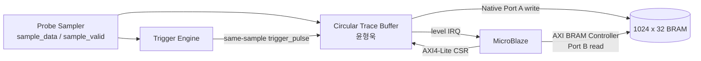

# 윤형욱 역할 필수 개념 학습서

대상 IP: Circular Trace Buffer + Capture BRAM  
기준 명세: EdgeScope-Lite Frozen v2.1  
목표: 팀원이 설계 이유, 동작 경계, 통합 방법을 물었을 때 근거를 들어 설명한다.

---

## 0. 이 문서 사용법

1. 먼저 **1~3장**을 읽고 30초 설명과 고정 숫자를 암기한다.
2. 다음으로 **4~8장**에서 FSM, 주소, AXI, BRAM을 RTL과 함께 이해한다.
3. 통합 전에는 **9~11장**의 순서와 문제 해결표를 확인한다.
4. 마지막으로 **12~14장**의 질문과 자가시험에 말로 답해 본다.

가장 중요한 세 문장은 다음과 같다.

> 이 IP는 BRAM의 1,024개 word를 원형으로 계속 덮어쓰다가 Trigger를 받으면,
> Trigger 직전 512개와 Trigger sample을 포함한 이후 512개를 보존한다.

> Trigger sample은 논리 index 512이며, Trigger 이후에 추가로 받는 sample은
> 512개가 아니라 511개다.

> 시스템은 반드시 `Buffer ARM → PRE_READY 확인 → Trigger Clear/ARM` 순서로
> 동작해야 한다.

---

## 1. 내 역할을 30초 안에 설명하기

윤형욱 담당 범위는 다음 네 부분이다.

1. `sample_valid`마다 sample을 BRAM Port A에 기록하는 Circular Buffer FSM
2. Trigger 전후 50:50 데이터를 정확히 남기는 pointer와 counter
3. MicroBlaze가 상태를 제어·조회하는 AXI4-Lite register wrapper
4. CPU가 Port B로 시간순 데이터를 읽을 수 있게 하는 BRAM 주소 계약



### 역할 경계

| 구분 | 내 소유 | 다른 담당자와 확인할 계약 |
|---|---|---|
| Sampler | 아님 | `sample_data`와 1-cycle `sample_valid`가 같은 sample인지 |
| Trigger Engine | 아님 | `trigger_pulse`가 현재 valid sample과 같은 cycle인지 |
| Trace Buffer FSM | 맞음 | 512:512, wrap, 제어 우선순위 |
| Trace AXI wrapper | 맞음 | register offset, W1P, status |
| BRAM Port A/주소 변환 | 맞음 | 10-bit word index와 32-bit byte address |
| BRAM Port B/CPU read | 통합 계약 소유 | CPU는 `DONE` 이후 read-only로 사용 |

### 초기 기획서보다 Frozen v2.1이 우선한다

| 항목 | 초기 설명에서 생길 수 있는 오해 | 최종 계약 |
|---|---|---|
| ARM 순서 | Trigger를 먼저 ARM | Buffer ARM → PRE_READY → Trigger ARM |
| CONTROL | 일반 R/W register | W1P, read 값 0 |
| Post capture | Trigger 이후 512개를 추가 | Trigger 포함 총 512개, 이후 추가는 511개 |
| BRAM 주소 | 모두 10-bit 주소 | Core는 word 10-bit, packaged/BMG는 byte 32-bit |
| START_ADDR | `0x08` 자체가 시작 주소 | `0x08`은 offset, 실제 값은 MMIO read |
| BRAM 크기 metadata | 생략 가능 | `MEM_SIZE=4096` 필수 |
| AXI 폭 | parameter로 변경 가능 | local address/data 6/32 고정 |

문서나 발표 자료가 충돌하면
[`day1_common_spec.md`](day1_common_spec.md)의 Frozen v2.1을 따른다.

---

## 2. 반드시 외워야 하는 고정값

| 항목 | 값 | 이유/의미 |
|---|---:|---|
| Clock | 100 MHz | 모든 IP와 BRAM 공통 clock |
| Probe/sample | 8 bits | 한 시점의 8-channel 값 |
| BRAM word | 32 bits | `{24'h0, sample[7:0]}` |
| BRAM depth | 1,024 words | 10-bit word address |
| BRAM 크기 | 4,096 bytes | `1024 × 4 bytes` |
| Pre-trigger | 512 samples | Trigger 직전 데이터 |
| Post-trigger | 512 samples | Trigger sample 포함 |
| Trigger 논리 index | 512 | 논리 배열의 513번째 원소 |
| AXI CSR | 32-bit data | 각 register는 4-byte 정렬 |
| AXI local address | 6 bits | offset `0x00`~`0x3F` |
| Reset | synchronous active-low | 낮은 값을 clock edge에서 샘플 |

다음 식도 외운다.

```text
start_addr      = (last_write_addr + 1) mod 1024
physical(i)     = (start_addr + i) mod 1024
trigger address = physical(512)
CPU byte addr   = BRAM_BASE + physical(i) * 4
```

`mod 1024`는 RTL에서 10-bit 덧셈 결과의 상위 carry가 잘리며 자연스럽게 구현된다.
C에서는 `& 0x3FF`로 같은 연산을 한다.

### 용어 빠른 정리

| 용어 | 뜻 |
|---|---|
| FSM | 상태와 전이로 동작을 표현하는 Finite State Machine |
| BRAM | FPGA 내부 Block RAM primitive |
| BMG | Vivado Block Memory Generator IP |
| CSR | Control/Status Register |
| MMIO | 메모리 주소로 peripheral register를 읽고 쓰는 방식 |
| W1P | 1을 write하면 1-cycle command pulse를 만드는 register |
| BD | Vivado IP Integrator Block Design |
| OOC | 상위 시스템과 분리해 IP만 합성·구현하는 Out-of-Context flow |
| WNS/WHS | Worst setup/hold Slack |
| Back-pressure | 수신 측이 READY를 낮춰 transaction 완료를 늦추는 것 |

---

## 3. Circular Buffer를 쓰는 이유

Trigger가 언제 발생할지 알 수 없으므로 일반 선형 버퍼는 끝에 도달하면 더 이상
최신 데이터를 보존하지 못한다. Circular Buffer는 마지막 주소 1023 다음을 다시
주소 0으로 연결해 항상 가장 최근 데이터를 유지한다.

### 네 주소의 차이

| 이름 | 의미 |
|---|---|
| `write_ptr_q` | **다음** valid sample을 쓸 주소 |
| `last_write_addr_q` / `WRITE_ADDR` | 가장 최근에 실제로 쓴 주소 |
| `trigger_addr_q` / `TRIGGER_ADDR` | Trigger sample이 저장된 물리 주소 |
| `start_addr_q` / `START_ADDR` | 완료 데이터를 시간순으로 읽을 첫 물리 주소 |

가장 많이 혼동하는 것은 `write_ptr`과 `write_addr`이다. Pointer는 다음 위치이고,
`WRITE_ADDR`는 이미 기록이 끝난 위치다.

### 왜 `START_ADDR = 마지막 주소 + 1`인가?

Capture 완료 시 BRAM 1,024칸은 모두 최종 데이터로 채워져 있다. 마지막 sample을
쓴 다음 칸은 원형 버퍼에서 다음에 덮어쓸 칸이며, 현재 남아 있는 데이터 중 가장
오래된 sample이다. 따라서 그 주소부터 읽으면 시간순이 된다.

### 실제 주소 예제

Trigger sample이 물리 주소 519에 저장됐다고 하자.

```text
Trigger address = 519
Trigger 이후 추가 sample = 511개
Last address = (519 + 511) mod 1024 = 6
Start address = (6 + 1) mod 1024 = 7

physical(512) = (7 + 512) & 0x3FF = 519
```

최종 배열은 다음 순서다.

```text
physical: 7, 8, ... 518, [519], 520, ... 1023, 0, ... 6
logical : 0, 1, ... 511, [512], 513, ................. 1023
                             ↑ Trigger sample
```

---

## 4. 정확한 512:512와 Off-by-one

### 최종 논리 배열

```text
Logical 0..511    : Trigger 직전 512개
Logical 512       : Trigger sample
Logical 513..1023 : Trigger 이후 511개
```

여기서 “post 512개”는 **Trigger sample을 포함**한다. 따라서 Trigger가 발생한 뒤
추가로 받는 sample은 511개다.

### Counter가 의미하는 것

`prefill_count_q`와 `post_count_q`는 모두 “이미 저장된 valid sample 수”다.

| 경계 | RTL 판단 | 현재 write 이후 결과 |
|---|---|---|
| PREFILL 종료 | `prefill_count == 511` | 512번째 pre sample 저장, `ARMED` 진입 |
| Trigger 수락 | `ARMED && valid && trigger` | Trigger sample 저장, `post_count = 1` |
| POST 종료 | `post_count == 511` | post #512 저장, `DONE` 진입 |

Trigger sample을 기록한 순간 `post_count=1`로 시작하는 것이 핵심이다. 0으로
시작하면 Trigger 이후 512개를 더 받아 총 513개가 되어 한 칸이 어긋난다.

### `sample_valid`가 모든 시간의 기준이다

다음 동작은 `sample_valid=1`일 때만 진행한다.

- BRAM write
- write pointer 증가
- pre/post counter 증가
- Trigger 수락

따라서 divider 때문에 valid pulse 사이에 공백이 생겨도 sample 개수 기준의
512:512는 유지된다. `trigger_pulse=1`이어도 `sample_valid=0`이면 무시한다.

### Trigger 정렬 계약

Trigger Engine의 pulse는 그 조건을 만족한 **현재 sample과 같은 cycle**이어야 한다.

```text
sample_data  = 현재 BRAM에 쓸 값
sample_valid = 1
trigger      = 1
```

이 세 신호가 같은 clock edge에 들어오면 현재 `write_ptr` 주소가
`TRIGGER_ADDR`로 저장된다. Trigger pulse를 한 cycle 늦게 register하면 실제 조건을
만족한 sample이 아니라 다음 sample이 Trigger로 표시되므로 명세 위반이다.

---

## 5. FSM과 제어 신호

### 다섯 상태

| 상태 | BRAM write | 의미 | 전이 |
|---|---:|---|---|
| `IDLE` | 정지 | 명령 대기 | ARM → `PREFILL` |
| `PREFILL` | valid마다 write | 최소 pre 512개 확보 | 512번째 valid → `ARMED` |
| `ARMED` | valid마다 circular write | Trigger 대기 | valid+trigger → `POST_CAPTURE` |
| `POST_CAPTURE` | valid마다 write | post 총 512개 확보 | 완료 → `DONE` |
| `DONE` | 정지 | 주소/status/IRQ 유지 | Clear → `IDLE`, ARM → 새 capture |

`PREFILL`의 Trigger와 512번째 prefill sample에 함께 들어온 Trigger는 의도적으로
무시한다. Trigger 수락 로직은 `ARMED` 상태에만 있기 때문이다.

### Status 의미

| Status | 1이 되는 상태/조건 | 특성 |
|---|---|---|
| `BUSY` | PREFILL, ARMED, POST | capture write 동작 중 |
| `PRE_READY` | ARMED, POST, DONE | pre 512개를 이미 확보 |
| `TRIGGERED` | Trigger 수락 후 | clear/abort/re-arm까지 latch |
| `DONE` | post 완료 후 | clear/abort/re-arm까지 latch |
| `IRQ` | `DONE`과 동일 | pulse가 아닌 active-high level |

`DONE`에서 `BUSY=0`, `PRE_READY=1`, `TRIGGERED=1`, `DONE=1`이므로 정상 상태값은
`0xE`다.

### 제어 우선순위

```text
reset > abort > clear_done > arm > normal capture
```

| 명령 | 동작 |
|---|---|
| Reset | 모든 state/pointer/address/status를 초기화 |
| Abort | 즉시 IDLE, address/status 초기화, 같은 cycle write도 차단 |
| Clear Done | DONE에서 done/trigger latch 해제 후 IDLE, 주소와 BRAM은 유지 |
| Arm | IDLE 또는 DONE에서 새 PREFILL, pointer/address/status 초기화 |
| Busy 중 Arm | 무시 |
| DONE에서 Arm | Clear 없이 바로 새 capture 가능 |

주의할 경계:

- ARM과 valid가 IDLE에서 같은 edge에 오면 그 sample은 저장되지 않는다.
  첫 저장은 PREFILL로 바뀐 다음 valid부터다.
- DONE에서 Clear와 Arm을 같은 AXI write로 동시에 보내면 Clear가 우선한다.
  새 capture를 원하면 다음 transaction에서 ARM을 다시 보낸다.
- Abort와 valid가 동시에 오면 `bram_en`이 `!abort`로 gate되어 추가 write가 없다.

---

## 6. BRAM 구조와 주소 단위

### 왜 True Dual Port인가?

| Port | 주체 | 사용 목적 |
|---|---|---|
| Port A | Circular Trace Buffer | FPGA capture write |
| Port B | AXI BRAM Controller | MicroBlaze 결과 read |

Capture 데이터 경로는 CPU 개입 없이 매 valid sample을 기록한다. CPU는 완료 후
별도 Port B에서 읽으므로 capture timing을 방해하지 않는다.

두 port가 동시에 접근할 수 있어도 이 프로젝트의 보장 범위는 `DONE=1` 이후
CPU read다. Capture 중 같은 주소를 읽었을 때의 값이나 충돌 동작에 의존하지 않는다.
True Dual Port는 BRAM 복사본 두 개가 아니라 **하나의 저장공간에 독립 port 두 개**가
있는 구조다.

Native Port B read는 synchronous 1-cycle latency다. 직접 native 신호를 다룬다면
enable/address를 넣은 다음 clock에 data를 확인해야 한다. MicroBlaze가 AXI BRAM
Controller를 통해 읽을 때는 Controller가 이 latency를 처리한다.

Reset, Abort, Clear Done은 BRAM의 모든 내용을 0으로 지우지 않는다. 이들은 제어
상태를 초기화하거나 완료 상태를 해제한다. 다음 capture가 유효 위치를 덮어쓰고,
소프트웨어는 완료된 1,024개만 읽는다.

### BRAM word 형식

```text
Word[31:8] = 24'h000000
Word[7:0]  = sample_data
WE[3:0]    = 4'b1111
```

8-bit sample을 32-bit word에 넣는 이유는 MicroBlaze와 AXI BRAM Controller의
32-bit 접근을 단순하게 만들기 위해서다.

### Word address와 Byte address

Core 내부 주소는 10-bit **word index**다.

```text
Core word index: 0..1023
```

Vivado 표준 BRAM interface와 CPU는 32-bit **byte address**를 사용하므로 packaged
top에서 두 비트 왼쪽으로 이동한다.

```text
byte_addr = word_index << 2

word 0    → byte 0x000
word 1    → byte 0x004
word 519  → byte 0x81C
word 1023 → byte 0xFFC
```

전체 주소 범위는 `0x000`~`0xFFF`, 즉 4 KiB다.

### 두 종류의 AXI 주소 영역을 구분한다

| 주소 영역 | 무엇을 읽나? | 예 |
|---|---|---|
| Trace Buffer CSR base | 상태와 주소 register | `TRACE_BASE + 0x08` |
| Capture BRAM base | 실제 sample word | `BRAM_BASE + physical*4` |

`TRACE_REG_START_ADDR`는 register의 **offset**이지 capture 시작 주소 값 자체가
아니다. 반드시 AXI read로 값을 얻는다.

---

## 7. AXI4-Lite에서 알아야 할 최소 개념

### Write channel은 주소와 데이터가 독립이다

AXI write는 다음 세 channel로 나뉜다.

- AW: write address
- W: write data와 byte strobe
- B: write response

AW와 W는 같은 cycle에 올 필요가 없다. Wrapper는 둘을 각각 한 번 보관한 뒤 모두
확보됐을 때만 command를 commit한다. BREADY가 늦어지면 BVALID를 유지하고 새
transaction을 받지 않는다.

### Read channel

- AR handshake에서 register 값을 `rdata_q`에 latch한다.
- RREADY가 늦어져도 RVALID와 RDATA를 유지한다.
- 이 간단한 peripheral은 한 번에 read 한 건만 outstanding으로 처리한다.

### W1P의 뜻

`CONTROL`은 값을 저장하는 R/W register가 아니라 Write-One-Pulse다.

```text
bit 0에 1 write → ARM pulse 1 cycle
bit 1에 1 write → CLEAR_DONE pulse 1 cycle
bit 2에 1 write → ABORT pulse 1 cycle
CONTROL read    → 항상 0
```

Control bit가 low byte에 있으므로 `WSTRB[0]=1`이어야 command가 발생한다.
Reserved bit와 read-only register write는 효과가 없다.

### Trace Buffer register map

| Offset | Register | 접근 | 핵심 값 |
|---:|---|---|---|
| `0x00` | CONTROL | W1P | ARM[0], CLEAR_DONE[1], ABORT[2] |
| `0x04` | STATUS | RO | BUSY[0], PRE_READY[1], TRIGGERED[2], DONE[3] |
| `0x08` | START_ADDR | RO | oldest physical word `[9:0]` |
| `0x0C` | TRIGGER_ADDR | RO | Trigger physical word `[9:0]` |
| `0x10` | WRITE_ADDR | RO | last written word `[9:0]` |
| `0x14` | CAPTURE_INFO | RO | depth `[10:0]`, Trigger index `[25:16]` |

각 IP는 서로 다른 AXI base address를 사용한다. 이 표의 값은 모두 각 base 기준
local byte offset이다.

### 6-bit local 주소와 4 KiB segment는 모순이 아니다

Trace wrapper의 6-bit 주소는 IP 내부 register를 고르는 local offset이다. 반면
Vivado Address Editor의 4 KiB는 시스템 주소 공간에서 IP에 예약하는 segment다.
상위 주소는 interconnect가 base address를 decode할 때 사용하고, IP에는 하위 local
offset이 전달된다.

Trace `s_axi`는 control/status register 경로이고, AXI BRAM Controller의 `S_AXI`는
실제 capture memory를 읽는 경로다. 두 slave는 서로 다른 4 KiB base address를
가져야 한다.

---

## 8. RTL을 읽을 때 볼 지점

| 질문 | 파일과 핵심 위치 |
|---|---|
| 언제 BRAM을 쓰는가? | `rtl/core/circular_trace_buffer_core.sv` 56~82행 |
| reset/abort/clear/arm 우선순위는? | Core 84~119행 |
| 512번째 pre sample은 어떻게 판단하나? | Core 125~136행 |
| Trigger sample을 post #1로 세는 곳은? | Core 139~149행 |
| 마지막 post와 START_ADDR 계산은? | Core 153~167행 |
| AXI AW/W를 독립 처리하는가? | `rtl/bus/circular_trace_buffer_axi.sv` 73~119행 |
| register read mux는? | AXI wrapper 121~158행 |
| word→byte 주소 변환은? | `rtl/top/capture_bram_addr_adapter.sv` 11~15행 |
| packaged IP clock/reset/BRAM 연결은? | `rtl/top/circular_trace_buffer_ip.sv` 46~96행 |
| 공통 고정값은? | `rtl/include/logic_analyzer_pkg.sv` |
| Vitis가 쓰는 상수는? | `sw/include/logic_analyzer_regs.h` |

Core와 packaged IP를 구분해야 한다.

```text
Core bram_addr_o       : 10-bit word index
Packaged bram_addr_o   : 32-bit byte address
Core bram_wdata_o      : write data
Packaged bram_wrdata_o : Vivado BRAM interface용 이름
```

---

## 9. 팀 통합에서 가장 중요한 순서

Trigger Engine은 one-shot이다. Buffer가 PREFILL인 동안 Trigger Engine을 먼저
ARM하면 pulse가 발생해도 Buffer가 무시하고, Trigger Engine은 Clear 전까지 다시
pulse를 내지 않을 수 있다. 그러면 Buffer는 영원히 Trigger를 기다린다.

### 안전한 소프트웨어 순서

```text
1. Sampler Disable 및 설정
2. Trigger Engine Clear — 아직 ARM하지 않음
3. Trace Buffer Abort 또는 이전 DONE Clear
4. Trace Buffer ARM
5. Sampler Enable
6. TRACE_STATUS.PRE_READY=1 poll
7. Trigger Engine Clear 후 ARM
8. TRACE_STATUS.DONE=1 또는 IRQ 대기
9. START_ADDR를 읽고 BRAM Port B에서 1,024개 read
```

핵심만 줄이면 다음과 같다.

```text
Buffer ARM → PRE_READY 확인 → Trigger Clear/ARM
```

### C 형태의 핵심 코드

```c
Xil_Out32(TRIGGER_BASEADDR + TRIGGER_REG_CONTROL,
          TRIGGER_CONTROL_CLEAR);
Xil_Out32(TRACE_BASEADDR + TRACE_REG_CONTROL,
          TRACE_CONTROL_ABORT);
Xil_Out32(TRACE_BASEADDR + TRACE_REG_CONTROL,
          TRACE_CONTROL_ARM);

/* Configure and enable the Sampler here. */

while ((Xil_In32(TRACE_BASEADDR + TRACE_REG_STATUS) &
        TRACE_STATUS_PRE_READY) == 0u) {
    /* Add timeout handling in the integrated software. */
}

Xil_Out32(TRIGGER_BASEADDR + TRIGGER_REG_CONTROL,
          TRIGGER_CONTROL_CLEAR);
Xil_Out32(TRIGGER_BASEADDR + TRIGGER_REG_CONTROL,
          TRIGGER_CONTROL_ARM);

while ((Xil_In32(TRACE_BASEADDR + TRACE_REG_STATUS) &
        TRACE_STATUS_DONE) == 0u) {
    /* Add timeout; issue TRACE_CONTROL_ABORT on failure. */
}
```

### 시간순 BRAM read

```c
uint32_t start =
    Xil_In32(TRACE_BASEADDR + TRACE_REG_START_ADDR) & TRACE_ADDR_MASK;

volatile uint32_t *trace_mem =
    (volatile uint32_t *)CAPTURE_BRAM_BASEADDR;

for (uint32_t i = 0; i < EDGE_SCOPE_CAPTURE_DEPTH; ++i) {
    uint32_t physical = (start + i) & TRACE_ADDR_MASK;
    uint8_t sample = (uint8_t)(trace_mem[physical] & 0xFFu);
    /* logical index i, sample */
}
```

---

## 10. Vivado Block Design와 IP Packaging

### 연결 구조

1. `circular_trace_buffer`의 `s_axi`를 SmartConnect/MicroBlaze에 연결
2. Trace Buffer `BRAM_PORTA`를 BMG Port A에 연결
3. AXI BRAM Controller의 BRAM Port를 BMG Port B에 연결
4. AXI BRAM Controller `S_AXI`를 SmartConnect에 연결
5. Trace register와 capture BRAM에 각각 4 KiB 주소 영역 배정
6. 모든 IP와 BRAM port를 같은 100 MHz clock에 연결
7. `irq`는 interrupt controller에 연결하거나 우선 DONE polling 사용

### 반드시 확인할 BRAM 값

```text
Write_Depth_A/B = 1024
Write_Width_A/B = 32
MEM_SIZE         = 4096
MEM_WIDTH        = 32
Address mode     = BYTE_ADDRESS
Common clock     = true
```

HDL port 폭과 IP-XACT metadata는 같은 것이 아니다. HDL은 전기적 신호 폭과
동작을 정의하고, metadata는 Vivado가 interface 의미와 downstream IP parameter를
어떻게 전파할지 정의한다.

```text
BRAM_PORTA metadata:
MEM_ADDRESS_MODE = BYTE_ADDRESS
MEM_SIZE         = 4096
MEM_WIDTH        = 32
READ_LATENCY     = 1

IRQ metadata:
SENSITIVITY      = LEVEL_HIGH
```

`MEM_SIZE`를 4096으로 고정하지 않으면 Vivado interface propagation이 기본
8192 bytes를 적용해 BMG depth를 2048로 바꿀 수 있다. 이 경우 메모리가 두 배가
되고 RAMB36E1도 2개가 필요할 수 있다.

`component.xml`은 결과 파일이다. Port나 metadata를 바꿀 때 이를 직접 고치지
말고 `scripts/package_trace_buffer_ip.tcl`을 수정하고 IP를 다시 package한다.

`validate_bd_design` PASS만으로 depth와 자원 수까지 증명되지는 않는다. Validation
후 propagated depth가 1024인지 확인하고, 통합 합성 netlist에서 RAMB36E1이 정확히
하나인지 다시 확인해야 한다.

### 정상으로 볼 수 있는 경고

- AXI BRAM Controller의 12-bit byte address가 BMG 32-bit address의 lower bits에
  연결된다는 width warning: 4 KiB 범위에서는 의도된 연결
- BMG OOC checkpoint의 기본 20 ns와 실제 10 ns clock이 다르다는 경고:
  최종 전체 BD implementation을 10 ns로 다시 sign-off

### 정상으로 넘기면 안 되는 증상

- Propagated BRAM depth가 2048
- `MEM_SIZE=8192`
- RAMB36E1이 2개 이상
- Trace AXI width를 6/32가 아닌 값으로 변경
- `irq`가 level-high interrupt interface로 인식되지 않음

---

## 11. 검증 결과를 설명하는 법

### 기능 회귀

```bash
./scripts/run_regression.sh
./scripts/run_regression.sh --waves
```

| Test | 무엇을 증명하나? |
|---|---|
| `tb_common_pkg` | Frozen v2.1 상수 일치 |
| `tb_*_basic` | reset, ARM, valid gating, 정확한 PREFILL |
| `tb_*_trigger` | same-sample Trigger, post 512, 시간순 read |
| `tb_*_wrap` | Trigger 주소 0/1/1022/1023 경계 wrap |
| `tb_*_control` | abort/clear/arm 우선순위, IRQ 유지 |
| `tb_*_axi` | offset, W1P, WSTRB, AW/W 순서, back-pressure |
| `tb_*_bram` | packaged top, byte 주소, Port B 1,024개 read |
| C static assert | RTL package와 C header 값 일치 |

### 합성·타이밍 수치

| 항목 | 확인 결과 | 의미 |
|---|---:|---|
| Custom IP LUT / FF | 73 / 90 | Trace Buffer 자체 OOC |
| Integrated LUT / FF | 338 / 306 | Trace+BMG+AXI BRAM Controller |
| RAMB36E1 | 1 | 1024×32 capture memory |
| Setup WNS | `+4.978 ns` | 가장 나쁜 setup path도 여유 있음 |
| Hold WHS | `+0.170 ns` | 가장 나쁜 hold path도 여유 있음 |
| Routed nets | 140 / 140 | unrouted/error net 없음 |

WNS나 WHS가 양수이고 TNS/THS가 0이면 해당 제약을 만족한다. 단, 위 timing은
Custom IP OOC 결과이므로 최종 MicroBlaze 전체 BD implementation의 setup/hold
sign-off를 대신하지 않는다.

왜 RAMB36E1 하나인지 설명할 수 있어야 한다.

```text
1024 words × 32 bits = 32768 bits
```

이는 36 Kb BRAM primitive 하나에 들어간다.

Custom IP 단독 utilization에서 BRAM이 0개로 나오는 것은 정상이다. Capture BMG는
Custom IP 외부에 별도 IP로 연결되며, 통합 subsystem 결과에서 RAMB36E1 1개를
확인한다.

---

## 12. 자주 발생하는 문제 해결표

| 증상 | 가장 먼저 의심할 원인 | 확인/해결 |
|---|---|---|
| `PRE_READY`가 안 됨 | Sampler disabled 또는 `sample_valid` 없음 | Sample count와 valid pulse 확인 |
| `PRE_READY=1`인데 영원히 DONE 안 됨 | Trigger를 PREFILL 전에 ARM해 one-shot 소진 | Trigger Clear 후 PRE_READY 상태에서 다시 ARM |
| Trigger sample이 한 칸 늦음 | Trigger pulse를 register해 다음 sample에 전달 | pulse를 현재 valid sample과 같은 cycle로 정렬 |
| Capture가 513 post처럼 보임 | Trigger sample을 post #1로 세지 않음 | Trigger 시 `post_count=1`, 이후 511개 |
| CPU 데이터 순서가 뒤섞임 | 물리 주소 0부터 읽음 | `START_ADDR`부터 modulo 1024 read |
| CPU 주소가 4배/4분의 1 어긋남 | word/byte 주소 혼동 | CPU byte 주소=`physical*4` |
| `trace_mem[4*i]`에서 sample 누락 | `uint32_t*`가 이미 ×4 수행 | `trace_mem[i]` 사용 |
| 반복 capture에서 이전 데이터가 보임 | D-cache의 stale line | non-cacheable 설정 또는 DONE 후 4 KiB invalidate |
| STATUS는 읽히는데 sample이 이상함 | CSR base와 BRAM base 혼동 | 두 주소 영역을 따로 확인 |
| ARM write가 효과 없음 | `WSTRB[0]=0`, 잘못된 base/offset | AXI transaction과 low-byte strobe 확인 |
| IRQ가 계속 1임 | IRQ를 pulse로 오해 | 정상 level 신호, CLEAR_DONE/ABORT/ARM 수행 |
| DONE 뒤에도 BRAM이 변함 | Port B write 또는 Port A wiring 오류 | CPU read-only, `bram_en/we` 확인 |
| BRAM depth가 2048 | interface `MEM_SIZE=8192` 전파 | Port A/B `MEM_SIZE=4096`, BD 재검증 |
| RAMB36E1이 2개 | 잘못된 depth/width | XCI와 propagated depth 1024 확인 |
| Vivado address width warning | 12-bit controller와 32-bit BMG 주소 | 4 KiB lower-bit 연결이면 정상 |
| Timing 숫자는 PASS인데 전체 시스템 실패 | OOC와 full BD 범위 혼동 | 전체 implementation에서 다시 sign-off |

디버깅 순서는 다음이 효율적이다.

```text
Clock/reset
→ sample_valid
→ FSM/STATUS
→ bram_en/we/address
→ Trigger 정렬
→ START_ADDR 재정렬
→ AXI software address
```

---

## 13. 팀원이 자주 물을 질문과 모범 답변

### Q1. 왜 Circular Buffer가 필요한가요?

Trigger 시점을 모르기 때문에 계속 최신 1,024개를 유지해야 합니다. Pointer만
순환시키면 데이터 이동 없이 매 valid sample을 한 번에 기록할 수 있습니다.

### Q2. 512 pre + 512 post인데 Trigger 뒤에는 왜 511개만 더 받나요?

Trigger가 발생한 현재 sample을 post 첫 번째로 포함하기 때문입니다.
`1 + 511 = 512`입니다.

### Q3. Trigger의 논리 index가 왜 512인가요?

앞에 pre sample 512개가 논리 index 0~511을 사용하므로 그다음인 512가
Trigger sample입니다.

### Q4. PREFILL의 Trigger를 왜 무시하나요?

Trigger 이전 데이터 512개가 아직 없으므로 50:50 결과를 만들 수 없기 때문입니다.
그래서 시스템에서 PRE_READY 이후 Trigger를 ARM해야 합니다.

### Q5. Trigger와 sample_valid가 따로 들어오면 어떻게 되나요?

Trigger는 `sample_valid=1`인 현재 sample과 같은 cycle일 때만 수락합니다.
valid가 없으면 저장할 sample 자체가 없으므로 무시합니다.

### Q6. `write_ptr`과 `WRITE_ADDR`가 같은 값 아닌가요?

아닙니다. `write_ptr`은 다음에 쓸 주소이고 `WRITE_ADDR`는 마지막으로 쓴 주소라
정상 capture 중에는 보통 한 칸 차이가 납니다.

### Q7. 마지막 post sample도 실제로 저장되나요?

저장됩니다. 해당 edge 직전 상태가 POST_CAPTURE라 BRAM write가 수행되고, 같은
edge에서 상태와 done latch가 DONE으로 갱신됩니다.

### Q8. `START_ADDR`부터 읽어야 하는 이유는 무엇인가요?

BRAM 물리 주소는 wrap되므로 주소 0이 가장 오래된 sample이라는 보장이 없습니다.
마지막 write의 다음 주소가 가장 오래된 sample입니다.

### Q9. 왜 Core 주소는 10-bit인데 packaged port는 32-bit인가요?

Core는 1,024개 word만 고르면 되지만 Vivado BRAM interface는 byte address를
사용합니다. Packaged top이 10-bit word index를 `<<2`해 32-bit byte 주소로
변환합니다.

### Q10. 왜 BRAM을 CPU가 직접 채우거나 읽으면서 capture하지 않나요?

AXI/CPU 지연이 capture sample rate를 따라가지 못할 수 있습니다. Port A의 native
hardware write로 timing을 보장하고 CPU는 DONE 이후 Port B에서 읽습니다.

### Q11. CONTROL을 읽으면 왜 항상 0인가요?

ARM/CLEAR/ABORT는 유지되는 설정값이 아니라 한 번 실행할 명령인 W1P이기
때문입니다. 현재 상태는 STATUS에서 확인합니다.

### Q12. AW와 W가 다른 cycle에 와도 되나요?

됩니다. AXI4-Lite에서 주소와 데이터 channel은 독립입니다. Wrapper가 각각
보관한 뒤 둘 다 있을 때 transaction을 commit합니다.

### Q13. `irq`가 한 cycle pulse인가요?

아닙니다. `DONE`과 같은 active-high level이며 소프트웨어가 clear, abort 또는
re-arm할 때까지 유지됩니다.

### Q14. Abort와 Clear Done의 차이는 무엇인가요?

Abort는 진행 중 capture까지 즉시 취소하고 주소/status를 초기화합니다.
Clear Done은 DONE 상태만 해제하며 완료 주소와 BRAM 내용은 유지합니다.

### Q15. 이 IP가 100 MHz를 만족한다고 말해도 되나요?

Custom IP OOC routed timing은 setup/hold를 만족합니다. 다만 전체 MicroBlaze
시스템도 만족한다고 말하려면 최종 BD implementation timing을 별도로 확인해야
합니다.

### Q16. Divider가 8이면 PREFILL은 512 clock인가요?

아닙니다. 512 **valid samples**가 필요하므로 valid가 8 system clock마다 한 번이면
PREFILL에는 4,096 system clocks가 필요합니다.

### Q17. `volatile`을 쓰면 MicroBlaze cache 문제도 해결되나요?

아닙니다. `volatile`은 compiler가 MMIO read를 생략하거나 재사용하지 못하게 하지만
hardware D-cache의 오래된 cache line까지 무효화하지는 않습니다. D-cache가
활성화됐다면 capture BRAM 영역을 non-cacheable로 두거나 DONE 후 해당 4 KiB를
invalidate해야 합니다.

### Q18. BD validation만 통과하면 BRAM 통합이 완료된 건가요?

아닙니다. Interface 구조 검사는 통과해도 parameter propagation 결과가 달라질 수
있습니다. Depth 1024, `MEM_SIZE=4096`, 통합 RAMB36E1 1개를 별도로 확인합니다.

### 정확하게 말하기

| 피해야 할 표현 | 정확한 표현 |
|---|---|
| “Trigger 이후 512개를 더 저장한다.” | “Trigger 포함 post 총 512개, 이후 511개를 더 저장한다.” |
| “Trigger 주소는 512다.” | “논리 index가 512이고 물리 주소는 가변이다.” |
| “PREFILL은 512 clock이다.” | “PREFILL은 512 valid samples이다.” |
| “BRAM 주소는 10-bit다.” | “Core는 10-bit word, packaged/BMG는 32-bit byte 주소다.” |
| “START_ADDR는 0x08이다.” | “0x08은 register offset이고 실제 값은 MMIO로 읽는다.” |
| “Clear하면 메모리가 지워진다.” | “Clear는 DONE/IRQ를 해제하며 BRAM 내용은 유지된다.” |
| “Dual Port니까 capture 중 read도 항상 안전하다.” | “이 프로젝트는 DONE 이후 CPU read만 보장한다.” |
| “전체 시스템 timing을 통과했다.” | “Custom IP OOC는 통과했고 전체 SoC는 별도 sign-off한다.” |

---

## 14. 스스로 해볼 실습과 자가시험

### 실습 A — RTL 경계 따라가기

1. Core에서 `write_ptr_q`가 “다음 주소”라는 주석을 찾는다.
2. PREFILL count 511에서 어떤 nonblocking assignment가 실행되는지 적는다.
3. Trigger cycle에 BRAM 주소와 `trigger_addr_q`가 왜 같은지 설명한다.
4. 마지막 post cycle에 `start_addr_q`가 왜 `write_ptr_q+1`인지 설명한다.

### 실습 B — 주소 계산

다음 네 Trigger 물리 주소에 대해 `last_addr`와 `start_addr`를 계산한다.

```text
0, 1, 1022, 1023
```

공식:

```text
last  = (trigger + 511) & 0x3FF
start = (last + 1) & 0x3FF
```

그리고 `(start + 512) & 0x3FF == trigger`인지 확인한다.

### 실습 C — 파형 보기

```bash
./scripts/run_regression.sh --waves
```

다음 세 경계를 찾는다.

1. PREFILL → ARMED
2. ARMED → POST_CAPTURE
3. POST_CAPTURE → DONE

발표용 요약 파형은
[`circular_trace_buffer_waveform.png`](circular_trace_buffer_waveform.png)에 있다.

### 실습 D — 팀원에게 말로 설명하기

아래 질문에 코드를 보지 않고 30초 안에 답한다.

1. Trigger 이후 추가 sample 수는?
2. CPU가 물리 주소를 계산하는 식은?
3. Trigger Engine은 언제 ARM하는가?
4. `MEM_SIZE`는 왜 4096이어야 하는가?
5. IRQ를 끄는 방법은?

### 자가시험

1. `sample_valid=0`, `trigger=1`이면 Trigger가 수락되는가?
2. 512번째 PREFILL sample과 Trigger가 동시에 오면 어떤 상태가 되는가?
3. Trigger address가 519일 때 START_ADDR은?
4. Core word address 519의 packaged byte address는?
5. DONE의 정상 STATUS 하위 4-bit 값은?
6. DONE에서 Clear와 Arm을 동시에 write하면 무엇이 우선인가?
7. Capture 중 CPU read가 보장되는가?
8. `MEM_SIZE=8192`가 잘못된 이유는?
9. WNS가 양수라는 것은 무엇을 뜻하는가?
10. 공통 Port/offset을 바꿀 때 함께 갱신할 세 파일은?
11. `volatile`이 D-cache coherence까지 보장하는가?
12. 6-bit AXI local address인데 4 KiB segment를 쓰는 이유는?

<details>
<summary>정답 보기</summary>

1. 수락되지 않는다.
2. Trigger는 무시되고 `ARMED`가 된다.
3. `7`
4. `519 × 4 = 2076 = 0x81C`
5. `0xE`
6. Clear Done
7. 보장하지 않으며 DONE 이후 읽는다.
8. 4 KiB가 아니라 8 KiB로 전파되어 depth 2048과 추가 BRAM을 만들 수 있다.
9. 가장 나쁜 setup path에도 해당 값만큼 시간 여유가 있다는 뜻이다.
10. `docs/day1_common_spec.md`, `rtl/include/logic_analyzer_pkg.sv`,
    `sw/include/logic_analyzer_regs.h`
11. 보장하지 않는다. Non-cacheable 설정 또는 cache invalidate가 별도로 필요하다.
12. 6-bit는 IP 내부 offset이고 4 KiB는 상위 interconnect가 decode하는 시스템
    주소 segment이기 때문이다.

</details>

---

## 15. 최종 암기 카드

```text
Depth        1024 x 32-bit = 4096 bytes
Pre/Post     512 / 512 (Trigger 포함)
Trigger idx  512
More after   511
Wrap         10-bit modulo 1024
Start        last + 1
CPU addr     BRAM_BASE + physical * 4
ARM order    Buffer ARM → PRE_READY → Trigger ARM
Priority     reset > abort > clear > arm > capture
IRQ          DONE과 같은 level
BRAM         Port A capture write / Port B CPU read after DONE
AXI CONTROL  W1P, read 0, WSTRB[0] 필요
```

### 기준 파일

- 공통 계약: [`day1_common_spec.md`](day1_common_spec.md)
- Core RTL: [`circular_trace_buffer_core.sv`](../rtl/core/circular_trace_buffer_core.sv)
- AXI wrapper: [`circular_trace_buffer_axi.sv`](../rtl/bus/circular_trace_buffer_axi.sv)
- Packaged top: [`circular_trace_buffer_ip.sv`](../rtl/top/circular_trace_buffer_ip.sv)
- C register header: [`logic_analyzer_regs.h`](../sw/include/logic_analyzer_regs.h)
- 검증 근거: [`verification_report.md`](verification_report.md)
- 팀 인수인계: [`yoon_hyungwook_handoff.md`](yoon_hyungwook_handoff.md)

문서 용도는 다음처럼 나눈다.

- 발표 전 빠른 복습: 이 학습서의 1~5장과 15장
- 팀 통합 작업: `yoon_hyungwook_handoff.md`
- 수치와 PASS 증거: `verification_report.md`
- Port/register 변경 판단: `day1_common_spec.md`
