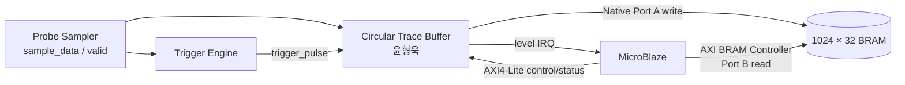
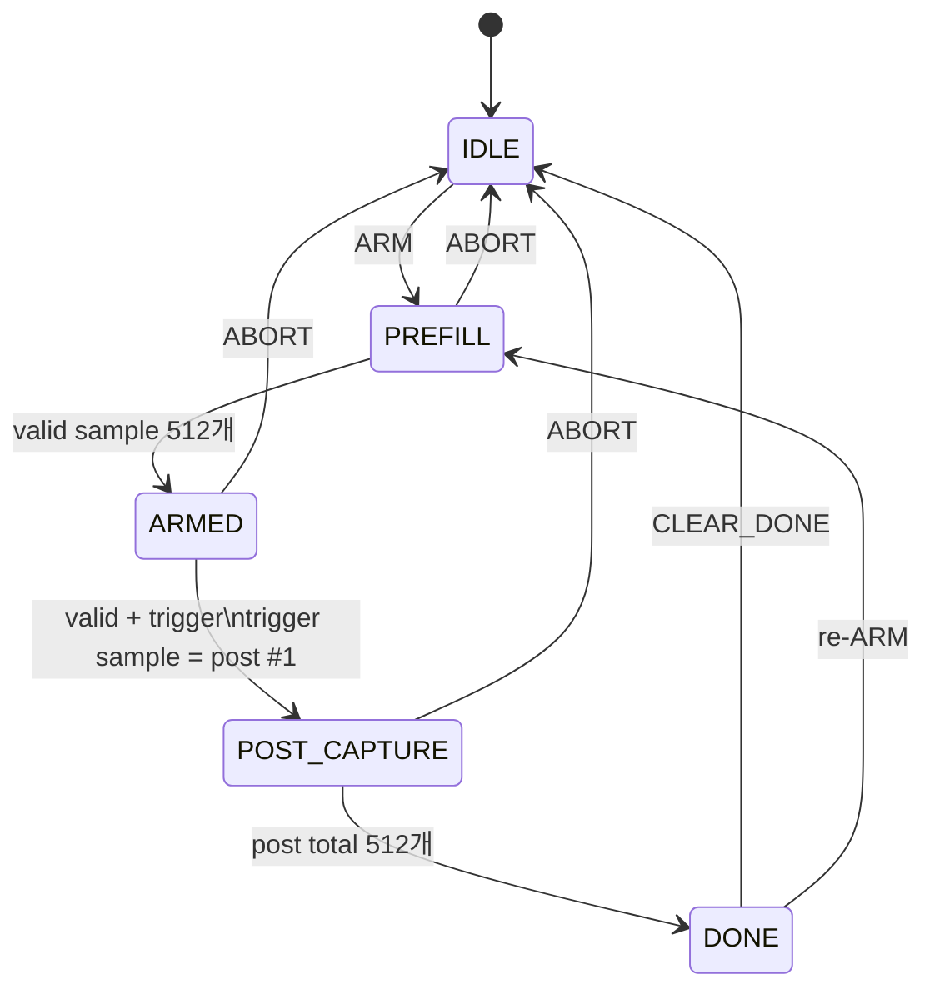
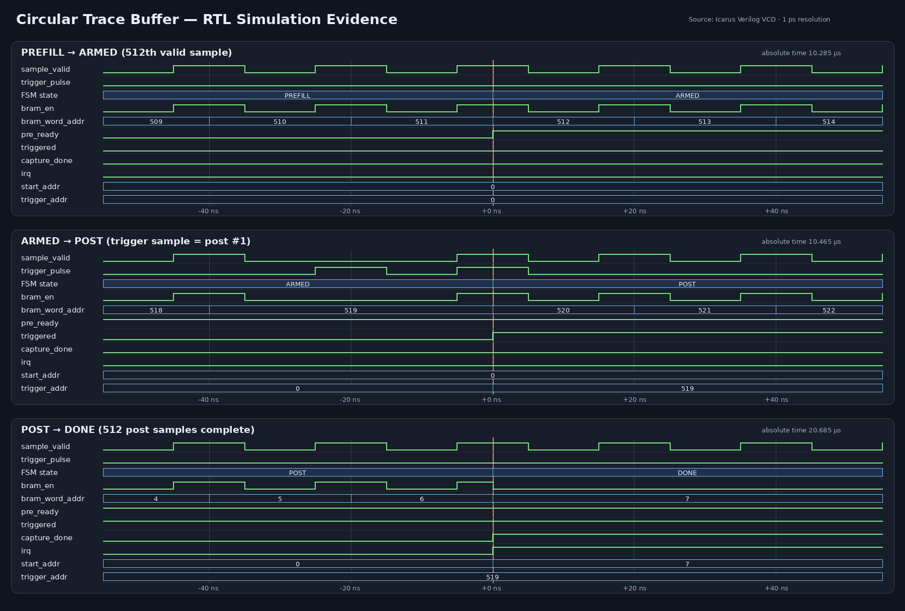

# 윤형욱 발표 슬라이드 및 대본

권장 분량: 4장, 약 3분

## Slide 1 — 담당 범위와 데이터 경로

**제목:** 1,024-Sample Circular Trace Buffer + Dual-Port BRAM



- FPGA가 sample마다 Port A에 write하고 CPU는 완료 후 Port B로 읽음
- Sample word는 `{24'h0, sample[7:0]}`, capture memory는 4 KiB
- CPU가 실시간 capture 경로에 개입하지 않는 구조

**말할 내용**

> 제 역할은 1,024개의 sample을 순환 저장하고 trigger 전후 50:50 데이터를
> 보존하는 Buffer와 BRAM 주소 정렬입니다. Capture 쪽은 Native Port A를 쓰고,
> MicroBlaze는 AXI BRAM Controller가 연결된 Port B를 완료 후 읽도록 분리했습니다.

## Slide 2 — FSM과 정확한 512:512 정의



- Logical `0..511`: trigger 직전 512개
- Logical `512`: trigger sample
- Logical `513..1023`: trigger 이후 511개
- `PREFILL`과 512번째 sample의 trigger는 무시
- 통합 순서: **Buffer ARM → PRE_READY 확인 → Trigger ARM**



**말할 내용**

> Off-by-one을 없애기 위해 trigger가 발생한 현재 sample을 post 첫 번째로
> 정의했습니다. 그래서 trigger 이후에는 511개만 더 받고 DONE으로 이동하며,
> 시뮬레이션에서 PREFILL, trigger, DONE 세 경계를 각각 확인했습니다.

## Slide 3 — Circular 주소와 CPU 재정렬

```text
마지막 write = 6          START_ADDR = 7

physical:  7, 8, ... 518, [519], 520, ... 6
logical :  0, 1, ... 511, [512], 513, ... 1023
                              ↑ trigger
```

```text
START_ADDR  = (LAST_WRITE_ADDR + 1) & 0x3FF
PHYSICAL(i) = (START_ADDR + i) & 0x3FF
CPU byte address = BRAM_BASE + PHYSICAL(i) × 4
```

- Core 10-bit word index → packaged BRAM 32-bit byte address: `word << 2`
- Trigger physical address 0, 1, 1022, 1023 경계 test 전부 PASS
- `MEM_SIZE=4096`을 interface metadata에 고정해 BD propagation 보호

**말할 내용**

> BRAM 내부 주소는 순환하므로 CPU가 0번부터 바로 읽으면 시간순이 아닙니다.
> 마지막 write의 다음 주소를 START로 제공하고, CPU는 10비트 modulo 덧셈으로
> 1,024개를 재정렬합니다. 32비트 word이므로 CPU 주소에는 4를 곱합니다.

## Slide 4 — 검증 결과와 해결한 문제

| 항목 | 결과 |
|---|---:|
| 회귀 | 7 SV tests + C header check PASS |
| Custom IP | 73 LUT, 90 FF, 0 DSP |
| Timing @ 100 MHz | Setup `+4.978 ns`, Hold `+0.170 ns` |
| Integrated subsystem | 338 LUT, 306 FF, **1 RAMB36E1** |
| Packaged IP/BD | integrity, catalog, validation, synthesis PASS |

문제 해결 사례:

1. Trigger를 먼저 ARM하면 PREFILL 중 one-shot trigger가 사라지는 통합 race 발견
2. BRAM interface 기본 8192 bytes가 BMG depth를 2048로 바꾸는 propagation 발견
3. ARM 순서와 `MEM_SIZE=4096`을 명세/Tcl에 고정하고 자동 assertion 추가

**마무리 대본**

> 단순히 단위 테스트만 통과한 것이 아니라 IP 패키지와 AXI BRAM Controller까지
> 연결한 상태에서 depth가 1,024이고 RAMB36이 1개인지 다시 합성해 확인했습니다.
> 최종 통합에서는 PRE_READY 이후 Trigger를 ARM하는 순서만 지키면 됩니다.

