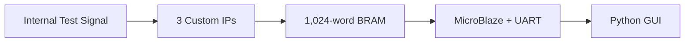

# EdgeScope-Lite GUI 시연 영상 시나리오

> 대상 시스템: Basys3 + MicroBlaze 기반 8채널 Standalone Logic Analyzer  
> 권장 영상 길이: **4분 30초~5분**  
> 권장 핵심 메시지: **“FPGA가 트리거 전후 데이터를 하드웨어로 캡처하고, GUI는 캡처가 끝난 1,024개 샘플을 UART로 받아 검증·시각화한다.”**

---

## 0. 최종 권장안

시연은 다음 세 단계로 구성한다.

1. **Rising Edge 상세 시연**
   - 100 MS/s, CH0 Rising
   - 트리거 인덱스 512와 50:50 Pre/Post 구조를 확대해 설명
2. **Falling 및 Masked Pattern 빠른 검증**
   - Falling은 Sample Divider 변경까지 함께 증명
   - Pattern은 `VALUE=0xA0`, `MASK=0xF0` 조건을 사용
3. **CSV/PNG 저장과 결과 요약**
   - 실제 UART 데이터 1,024개 수신
   - GUI 자동 검증 결과 `PASS`
   - 준비된 경우에만 실제 Timing/Resource 수치를 표시

세 Trigger Mode를 똑같은 길이로 반복하면 영상이 지루해진다.  
따라서 **Rising은 원리를 자세히**, Falling과 Pattern은 **기능 범위를 짧고 명확하게** 보여주는 구성이 가장 좋다.

---

## 1. 시연에서 반드시 증명할 것

| 증명 항목 | 화면에서 보여줄 근거 |
|---|---|
| 8채널 동시 Sampling | CH0~CH7 파형을 같은 시간축에 표시 |
| 최대 100 MS/s | `Sample Rate = 100 MS/s`, `Sample Period = 10 ns` 표시 |
| 1,024 Sample Capture | `Samples Received = 1024 / 1024` 표시 |
| 50:50 Pre/Post Capture | 인덱스 `0~511` Pre, `512~1023` Post 영역 구분 |
| Trigger 정렬 | 빨간 Trigger Cursor가 Logical Index `512`에 위치 |
| Rising/Falling Trigger | 인덱스 511과 512의 대상 채널 값을 GUI가 비교 |
| Masked Pattern Trigger | `(sample & mask) == (value & mask)` 결과 표시 |
| Circular Buffer 재정렬 | GUI에는 물리 BRAM 주소가 아닌 시간순 Logical Index로 표시 |
| Standalone 동작 | Vivado ILA 화면 없이 Basys3와 GUI만으로 Capture 수행 |
| UART 비실시간 구조 | Capture 완료 후 1,024개 Sample을 일괄 수신한다고 설명 |

### Trigger 위치 표현 시 주의

정확한 정의는 다음과 같다.

```text
Logical Index 0~511    : Trigger 직전 512 Samples
Logical Index 512      : Trigger Sample
Logical Index 513~1023 : Trigger 이후 511 Samples
```

따라서 발표에서는 다음과 같이 말한다.

> “Trigger Sample을 포함한 Post-trigger 영역이 512개입니다.”

다음 표현은 사용하지 않는다.

> “Trigger 이후에만 512개가 추가로 저장됩니다.”

---

## 2. GUI 구현 기준

### 2.1 GUI의 정확한 범위

이 GUI는 **실시간 Streaming Oscilloscope가 아니라 One-shot Capture Viewer**이다.



- FPGA가 100 MHz Clock Domain에서 실제 Sampling과 Trigger를 처리한다.
- MicroBlaze는 설정, Arm, 완료 확인, BRAM Read, UART 출력을 담당한다.
- GUI는 Capture 완료 후 전달된 데이터를 파싱해 파형을 표시한다.
- UART 속도는 화면 표시 지연에는 영향을 주지만, 이미 BRAM에 저장된 Capture 정확도에는 영향을 주지 않는다.

### 2.2 권장 화면 구성

| 영역 | 필수 UI 요소 |
|---|---|
| Connection | Port, Baud Rate, Connect/Disconnect, `LIVE UART` 표시 |
| Capture Settings | Divider, Sample Rate, Channel Mask |
| Trigger Settings | Mode, Edge Channel, Pattern Value, Pattern Mask |
| Capture Control | Apply, Arm & Capture, Abort, Clear |
| Status | IDLE/PREFILL/ARMED/TRIGGERED/DONE 또는 수신 가능한 상태 정보 |
| Summary | 8 Channels, 1,024 Samples, Trigger Index 512, Capture/Dump Time |
| Waveform | CH0~CH7 Digital Trace, Trigger Cursor, Pre/Post 배경 구분 |
| Validation | Sample Count, Trigger Index, Edge/Pattern Condition의 PASS/FAIL |
| Data | 선택 Sample의 Index, Time, Hex, CH7~CH0 Bit 값 |
| Export | CSV 저장, PNG 저장 |
| Log | UART 원문 또는 핵심 이벤트 로그 |

### 2.3 촬영용으로 추가하면 좋은 기능

- `DEMO 1 – Rising CH0 100M`
- `DEMO 2 – Falling CH1 12.5M`
- `DEMO 3 – Pattern A0/F0`

위 세 개의 **Preset 버튼**을 제공하면 촬영 중 설정 실수를 줄일 수 있다.  
Preset은 저장된 파형을 불러오는 기능이 아니라, 실제 보드에 보낼 설정만 자동 입력해야 한다.

### 2.4 GUI 자동 검증 규칙

#### 공통 검증

```text
received_sample_count == 1024
trigger_index == 512
```

#### Rising Edge

```text
CHx[511] == 0
CHx[512] == 1
```

#### Falling Edge

```text
CHx[511] == 1
CHx[512] == 0
```

#### Masked Pattern Entry

```text
(sample[512] & pattern_mask) == (pattern_value & pattern_mask)
(sample[511] & pattern_mask) != (pattern_value & pattern_mask)
```

검증 결과는 우측 상단에 다음처럼 크게 표시한다.

```text
CAPTURE VALID
Samples      1024 / 1024  PASS
Trigger      Index 512    PASS
Condition    Rising CH0   PASS
```

### 2.5 UART 명령 지원 여부에 따른 UI 처리

촬영 전에 Embedded C가 **PC→보드 설정 명령**을 실제로 지원하는지 확인한다.

| Firmware 상태 | GUI 동작 |
|---|---|
| 설정·Arm 명령 지원 | GUI에서 Divider, Trigger, Mask를 설정하고 `Arm & Capture` 실행 |
| Capture 자동 실행·출력만 지원 | 설정 영역을 Read-only로 표시하고 `Receive Capture`만 사용 |

Firmware가 지원하지 않는 기능을 GUI 버튼으로만 흉내 내면 안 된다.  
양방향 명령을 구현하지 않은 상태라면 영상 내 설정 변경은 Firmware의 검증된 Profile 선택 방식으로 수행하고, GUI에는 실제 적용된 설정값만 표시한다.

---

## 3. 촬영 전 고정할 Demo Profile

### 3.1 Demo 1 — 메인 시연

| 항목 | 설정값 |
|---|---|
| Profile | `DEMO 1 – Rising CH0 100M` |
| Sample Divider | `1` |
| Sample Rate | `100 MS/s` |
| Sample Period | `10 ns` |
| Channel Mask | `0xFF` |
| Trigger Mode | `Rising Edge` |
| Edge Channel | `CH0` |
| Capture Depth | `1,024` |
| Trigger Index | `512` |
| 예상 조건 | `CH0[511]=0`, `CH0[512]=1` |

100 MS/s에서 1,024개 Sample은 약 **10.24 µs 분량**이다.

Trigger를 시간축 `0`으로 표시할 경우:

| Logical Index | 상대 시간 |
|---:|---:|
| 0 | `-5.12 µs` |
| 511 | `-10 ns` |
| 512 | `0 ns` |
| 1023 | `+5.11 µs` |

### 3.2 Demo 2 — Divider와 Falling Trigger

| 항목 | 설정값 |
|---|---|
| Profile | `DEMO 2 – Falling CH1 12.5M` |
| Sample Divider | `8` |
| Sample Rate | `12.5 MS/s` |
| Sample Period | `80 ns` |
| Channel Mask | `0xFF` |
| Trigger Mode | `Falling Edge` |
| Edge Channel | `CH1` |
| 예상 조건 | `CH1[511]=1`, `CH1[512]=0` |

이 장면 하나로 **Divider 설정이 실제 Sample Rate 표시에 반영되는 것**과 **Falling Trigger**를 함께 증명한다.

### 3.3 Demo 3 — Masked Pattern Trigger

| 항목 | 설정값 |
|---|---|
| Profile | `DEMO 3 – Pattern A0/F0` |
| Sample Divider | 사전 검증에서 가장 안정적인 값 |
| Channel Mask | `0xFF` |
| Trigger Mode | `Masked Pattern` |
| Pattern Value | `0xA0` |
| Pattern Mask | `0xF0` |
| 의미 | 상위 4비트가 `1010`, 하위 4비트는 Don't Care |
| 예상 조건 | `(sample[512] & 0xF0) == 0xA0` |

GUI에는 다음처럼 표시한다.

```text
Sample[512] = 0xA?
Mask        = 0xF0
Result      = MATCH / PASS
```

`?`에 해당하는 하위 4비트는 실제 Capture 값으로 표시한다.

---

## 4. 4분 50초 권장 Storyboard

| 시간 | 화면/촬영 | 조작 | 내레이션 핵심 | 성공 기준 |
|---|---|---|---|---|
| 0:00~0:12 | 완성된 GUI 파형과 Basys3를 Split Screen으로 먼저 제시 | Trigger Cursor 주변을 짧게 확대 | “8채널 신호를 100 MS/s로 캡처하고, Trigger 전후 파형을 PC GUI에서 확인하는 EdgeScope-Lite입니다.” | 첫 10초 안에 결과와 보드가 모두 보임 |
| 0:12~0:30 | 간단한 Architecture 이미지 또는 GUI의 About 패널 | Data Flow를 순서대로 강조 | “세 Custom IP가 Sampling, Trigger, Circular Buffer를 담당하고, MicroBlaze가 Capture 완료 후 UART로 데이터를 전달합니다.” | Custom IP 3개 이름 표시 |
| 0:30~0:48 | 실제 GUI Connection 화면 | 실제 Port 선택 후 Connect | “Vivado ILA가 아닌 Basys3와 GUI만으로 동작합니다.” | `CONNECTED`, `LIVE UART` 표시 |
| 0:48~1:08 | Demo 1 설정 패널 | Rising CH0, Divider 1, Mask FF 적용 | “첫 번째는 100 MS/s, CH0 Rising Edge 조건입니다. 8개 채널을 모두 활성화합니다.” | Rate 100 MS/s, Depth 1024, Trigger 512 표시 |
| 1:08~1:27 | Board Camera와 GUI 상태를 함께 표시 | `Arm & Capture` 클릭 | “ARM 후 512개 Pre-trigger Sample을 확보하고, 조건이 발생하면 Trigger Sample을 포함해 Post 영역을 완성합니다.” | 실제 Capture 수행, 결과 1024개 수신 |
| 1:27~1:48 | 전체 8채널 파형 | 전체 구간 Fit | “CH0부터 CH7까지 같은 Sampling Edge에서 수집된 데이터입니다.” | 8개 Trace가 동일 시간축에 표시 |
| 1:48~2:17 | Trigger Cursor 주변 확대 | Index 508~516 정도로 Zoom | “빨간 선이 Logical Index 512입니다. CH0이 직전 Sample의 0에서 Trigger Sample의 1로 바뀌어 Rising 조건을 만족합니다.” | CH0[511]=0, CH0[512]=1, PASS |
| 2:17~2:38 | Pre/Post 영역과 CH2·CH4 등을 강조 | 채널 숨김/표시 또는 Cursor 이동 | “왼쪽에는 직전 512개, 오른쪽에는 Trigger를 포함한 512개가 보존됩니다. 짧은 Pulse와 서로 다른 주기의 채널도 동시에 확인할 수 있습니다.” | Pre/Post 음영, 다채널 신호 확인 |
| 2:38~2:58 | Demo 2 설정과 결과를 빠르게 연결 | Falling CH1, Divider 8 Capture | “Divider 8에서는 12.5 MS/s로 동작하며, CH1의 1에서 0 변화가 다시 Index 512에 정렬됩니다.” | CH1 Falling PASS |
| 2:58~3:27 | Demo 3 설정 및 결과 | Pattern A0/F0 Capture | “마지막은 상위 4비트가 1010일 때만 동작하는 Masked Pattern Trigger입니다. 하위 4비트는 비교에서 제외됩니다.” | Pattern Entry PASS |
| 3:27~3:49 | Validation 패널과 Raw Data/표 | Index 511, 512 두 행 선택 | “GUI는 1,024개 수신 여부, Trigger 위치, 실제 조건을 자동 검증합니다.” | 공통 및 조건 검증이 모두 PASS |
| 3:49~4:05 | Export 영역 | CSV와 PNG 저장 | “원본 데이터는 CSV로, 발표용 파형은 PNG로 저장할 수 있습니다.” | 저장 완료 메시지와 파일명 표시 |
| 4:05~4:28 | 실제 수치가 준비된 경우 Resource/Timing 결과 카드 | 측정값을 한 화면에 표시 | “동일한 8비트, 1,024 Sample, 100 MHz 조건으로 ILA와 비교했으며, 목표 기능에 맞춘 경량 구조의 실제 자원 결과는 다음과 같습니다.” | TBD 없는 실제 보고서 수치만 사용 |
| 4:28~4:50 | Basys3와 최종 GUI 결과 | Trigger 전체 파형으로 복귀 | “EdgeScope-Lite는 실시간 처리를 FPGA에 맡기고, MicroBlaze와 GUI로 설정과 결과 확인을 분리한 Standalone Logic Analyzer입니다.” | 보드·GUI·프로젝트명으로 종료 |

---

## 5. 그대로 읽을 수 있는 내레이션 대본

### Scene 1 — Hook

> EdgeScope-Lite는 Basys3의 MicroBlaze SoC에서 동작하는 8채널 Standalone Logic Analyzer입니다. 최대 100 MS/s로 신호를 동시에 샘플링하고, Trigger 전후 총 1,024개 데이터를 보존합니다.

### Scene 2 — Architecture

> Probe Sampler가 8개 채널을 같은 Clock Edge에서 수집하고, Basic Trigger Engine이 Rising, Falling 또는 Masked Pattern 조건을 판정합니다. Circular Trace Buffer는 Trigger 이전 데이터와 이후 데이터를 BRAM에 저장합니다. MicroBlaze는 실시간 Sampling에 개입하지 않고 설정, 완료 확인, 메모리 읽기와 UART 전송만 담당합니다.

### Scene 3 — Connection

> 지금 Basys3와 GUI를 UART로 연결했습니다. 이 시연은 Vivado ILA 화면이나 JTAG 파형 창에 의존하지 않고, 보드에서 Capture한 결과를 독립적으로 확인합니다.

### Scene 4 — Rising 설정

> 첫 Capture는 Divider 1, 즉 100 MS/s로 설정하고, 전체 8개 채널을 활성화합니다. Trigger 조건은 CH0의 Rising Edge이며, Trigger 위치는 Logical Index 512입니다.

### Scene 5 — Arm

> Arm 명령 후 먼저 512개의 Pre-trigger Sample을 확보합니다. 이후 CH0에서 Rising Edge가 검출되면 해당 Sample을 Trigger Sample로 저장하고, 나머지 Post-trigger 구간을 채운 뒤 Capture를 종료합니다.

### Scene 6 — 전체 파형

> Capture가 완료되었고 UART를 통해 정확히 1,024개 Sample을 수신했습니다. GUI에 표시된 CH0부터 CH7까지는 모두 동일한 Sampling 시점에 수집된 데이터입니다.

### Scene 7 — Trigger 확대

> Trigger 주변을 확대하면 인덱스 511에서 CH0은 0이고, 인덱스 512에서 1로 바뀝니다. 따라서 Rising Edge 조건과 Trigger 위치가 모두 PASS입니다.

### Scene 8 — Pre/Post 설명

> Trigger Cursor 왼쪽의 0번부터 511번까지는 Trigger 직전 512개 Sample입니다. 512번은 Trigger Sample이며, 1023번까지가 Trigger를 포함한 512개의 Post-trigger 영역입니다. 이 구조로 사건이 발생하기 이전의 원인 신호도 함께 확인할 수 있습니다.

### Scene 9 — Falling

> 두 번째 Capture에서는 Divider를 8로 변경해 12.5 MS/s로 동작시키고, CH1 Falling Edge를 선택했습니다. 인덱스 511의 1이 인덱스 512에서 0으로 바뀌므로 Falling 조건도 정상입니다.

### Scene 10 — Masked Pattern

> 세 번째는 Masked Pattern Trigger입니다. Value는 A0, Mask는 F0으로 설정했습니다. 따라서 상위 4비트가 1010인지만 비교하고, 하위 4비트는 무시합니다. Trigger Sample에서 조건이 일치하고 직전 Sample에서는 일치하지 않아 Pattern 진입 시 한 번만 Trigger된 것을 확인할 수 있습니다.

### Scene 11 — UART와 Export

> UART는 실시간 Sample을 전송하는 용도가 아닙니다. FPGA가 먼저 정확한 Timing으로 Capture를 완료한 뒤 데이터를 일괄 전송하므로, UART 전송 시간은 Capture 정확도에 영향을 주지 않습니다. 수신한 원본 데이터는 CSV로, 파형 화면은 PNG로 저장할 수 있습니다.

### Scene 12 — 결론

> EdgeScope-Lite는 범용 ILA의 모든 기능을 복제한 제품이 아니라, 8채널 Sampling, Basic Trigger, Circular Capture에 집중한 경량 Standalone Analyzer입니다. 실시간 동작은 FPGA가 담당하고, MicroBlaze와 GUI는 제어와 시각화를 담당하도록 역할을 분리했습니다.

---

## 6. GUI 화면에 넣을 권장 문구

### Header

```text
EdgeScope-Lite
8-Channel 100 MS/s Standalone Logic Analyzer
```

### Capture Summary

```text
Source          LIVE UART
Channels        8
Sample Rate     100 MS/s
Sample Period   10 ns
Depth           1,024 Samples
Trigger         Rising CH0
Trigger Index   512
```

### 완료 상태

```text
CAPTURE COMPLETE
Received        1,024 / 1,024
Trigger Index   512
Validation      PASS
```

### 하단 설명

```text
One-shot capture: samples are transferred after BRAM capture completes.
```

---

## 7. 촬영 환경

### 권장 구성

- 화면 녹화: OBS Studio
- 해상도: 1920×1080
- Frame Rate: 30 fps
- 화면 배율: GUI 글자가 영상에서 읽히도록 125~150%
- Board Camera: Basys3와 Micro-USB 연결 상태가 보이도록 고정
- Audio: 별도 마이크 또는 스마트폰 녹음 후 동기화
- 알림: Ubuntu 알림과 메신저 팝업 모두 끄기
- Desktop: Vivado, Terminal, 개인 파일이 보이지 않도록 정리

### 권장 화면 배치

- 기술 설명 장면: GUI 80%, Board Camera 20%
- Arm 장면: GUI 70%, Board Camera 30%
- Trigger 분석 장면: GUI 파형을 전체 화면
- Ending: GUI 75%, Board Camera 25%

### 촬영 파일

```text
01_hook.mp4
02_connect_and_rising.mp4
03_falling_and_pattern.mp4
04_export_and_result.mp4
05_narration.wav
```

최종 Export 파일:

```text
edgescope_rising_ch0_100m.csv
edgescope_rising_ch0_100m.png
edgescope_falling_ch1_12_5m.csv
edgescope_pattern_a0_f0.csv
```

---

## 8. 촬영 전 리허설 체크리스트

### Hardware/Firmware

- [ ] 최종 Bitstream과 ELF가 보드에 정상 Program됨
- [ ] UART Port를 다시 연결해도 GUI가 정상 복구됨
- [ ] UART Header와 `CAPTURE_END`를 GUI가 정확히 파싱함
- [ ] 각 Capture에서 1,024개 Sample이 수신됨
- [ ] START_ADDR 기준 Circular 데이터 재정렬이 정상임
- [ ] Capture 중이 아니라 DONE 이후 BRAM을 읽음
- [ ] 동일 시연을 3회 연속 성공함

### Rising Demo

- [ ] Divider 1이 100 MS/s로 표시됨
- [ ] CH0[511] = 0
- [ ] CH0[512] = 1
- [ ] Trigger Cursor = 512
- [ ] CH0~CH7이 모두 표시됨

### Falling Demo

- [ ] Divider 8이 12.5 MS/s로 표시됨
- [ ] CH1[511] = 1
- [ ] CH1[512] = 0
- [ ] Trigger Cursor = 512

### Pattern Demo

- [ ] Value = 0xA0
- [ ] Mask = 0xF0
- [ ] Index 511은 Pattern 불일치
- [ ] Index 512는 Pattern 일치
- [ ] Pattern이 유지되어도 Trigger는 한 번만 판정됨

### GUI/Recording

- [ ] Port 이름 외에 개인 정보가 화면에 없음
- [ ] 파형 색상과 Channel Label이 구분됨
- [ ] Trigger Cursor가 빨간색으로 명확함
- [ ] Pre/Post 영역이 서로 다른 옅은 배경색으로 표시됨
- [ ] PASS/FAIL 문구가 영상에서도 읽힘
- [ ] 마우스 Cursor를 빠르게 흔들지 않음
- [ ] 설정 변경 후 1초 정도 멈추고 시청자가 값을 읽게 함
- [ ] 실제 측정되지 않은 Resource/Timing 숫자가 없음

---

## 9. 실패 상황별 대응

| 문제 | 영상 중 대응 | 촬영 전 해결 |
|---|---|---|
| Serial Port 연결 실패 | 해당 Take를 중단하고 재연결 후 처음부터 촬영 | Port 자동 새로고침과 재연결 버튼 구현 |
| Sample이 1,024개 미만 | GUI에서 `INCOMPLETE`로 표시하고 해당 Take 폐기 | Header/End Marker, Line Parser 점검 |
| Trigger가 511 또는 513에 표시 | 촬영하지 말고 HW/SW 주소 재정렬 수정 | START_ADDR와 Trigger Index 계산 재검증 |
| Pattern Capture Timeout | Abort 후 검증된 Pattern Profile 사용 | Test Generator Pattern 주기 사전 확인 |
| GUI가 멈춤 | Hex Terminal Backup으로 기능 확인 후 재촬영 | UART Read Thread와 UI Thread 분리 |
| CSV Export 실패 | PNG만으로 넘어가지 말고 Take 재촬영 | 기본 Hex 수신 로그를 Backup으로 유지 |
| Resource 수치 미완성 | Resource 장면 자체를 제거 | 절대 예상값이나 TBD를 실측값처럼 제시하지 않음 |

### Backup 원칙

- 저장된 Capture를 사용하면 화면에 `RECORDED CAPTURE`라고 명시한다.
- 저장된 데이터를 `LIVE UART`로 표시하지 않는다.
- GUI 실패 시에도 UART Hex 출력은 최종 Backup 경로로 유지한다.

---

## 10. 최종 편집 원칙

- 첫 장면에서 긴 로고 Animation을 사용하지 않는다.
- 설정 클릭 장면보다 Trigger 결과 분석 장면에 더 많은 시간을 배정한다.
- UART Raw Data 1,024줄을 끝까지 스크롤하지 않는다.
- Index 511과 512, 전체 Sample Count, Trigger Cursor를 Close-up으로 보여준다.
- Capture 대기 시간이 길면 중간 구간만 배속하고 `Capture wait ×4`처럼 표시한다.
- 실제 Live Capture의 시작과 완료는 순서를 바꾸지 않는다.
- Background Music은 내레이션보다 충분히 작게 사용한다.
- 핵심 수치는 자막으로 한 번 더 표시한다.

권장 고정 자막:

```text
8 Channels | 100 MS/s | 1,024 Samples | Trigger @ 512
```

---

## 11. 발표 및 영상에서 피할 표현

| 피할 표현 | 권장 표현 |
|---|---|
| “MCU로는 구현할 수 없습니다.” | “FPGA는 다채널 동시 Sampling과 고정된 Trigger Timing에 유리합니다.” |
| “ILA보다 모든 면에서 우수합니다.” | “목표 기능에 맞춰 범용 기능을 줄인 경량 Standalone 구조입니다.” |
| “UART로 100 MS/s를 실시간 전송합니다.” | “100 MS/s로 BRAM Capture 후 UART로 일괄 전송합니다.” |
| “Trigger 뒤 512개를 더 저장합니다.” | “Trigger Sample을 포함한 Post 영역이 512개입니다.” |
| “GUI가 신호를 Sampling합니다.” | “FPGA가 Sampling하고 GUI는 설정·검증·시각화를 담당합니다.” |
| “예상 절감률은 실제 결과입니다.” | “Implementation Report에서 확인한 실측값입니다.” |

---

## 12. 촬영 직전 30초 점검표

- [ ] 화면에 `LIVE UART`
- [ ] 올바른 Port와 Baud Rate
- [ ] `Samples 1024/1024`
- [ ] `Trigger Index 512`
- [ ] Rising/Falling/Pattern 조건 PASS
- [ ] Trigger Cursor와 CH Label 표시
- [ ] 실측값 없는 Resource 장면 제거
- [ ] OBS 녹화 표시 확인
- [ ] 마이크 입력 Level 확인
- [ ] Basys3가 Camera Frame 안에 있음

---

## 13. 한 문장 결론

> **EdgeScope-Lite는 FPGA에서 8채널 신호를 최대 100 MS/s로 동시에 캡처하고, Trigger 전후 1,024개 Sample을 보존한 뒤 MicroBlaze와 GUI를 통해 독립적으로 분석하는 경량 Standalone Logic Analyzer이다.**

---

## 14. 본 시나리오의 기준 사양

- 8-bit Probe
- 100 MHz System/Capture Clock
- Divider 1/2/4/8
- 100/50/25/12.5 MS/s
- Rising/Falling/Masked Pattern Trigger
- 1,024 × 32-bit Dual-port BRAM
- 512 Pre-trigger Samples
- Trigger Sample을 포함한 512 Post-trigger Samples
- Trigger Logical Index 512
- Capture 완료 후 UART Hex/CSV 출력
- GUI는 Post-capture One-shot Viewer

### 참고한 프로젝트 문서

- `README.md`
- `EdgeScope_Lite_SoC_Project_Plan.md`
- `docs/day1_common_spec.md` — Frozen v2.0
